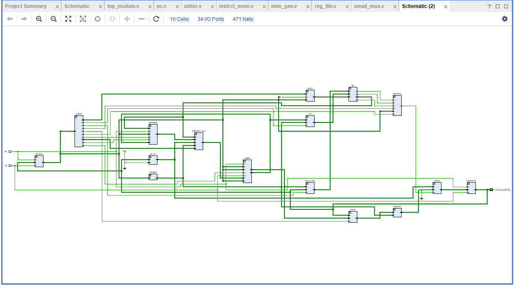
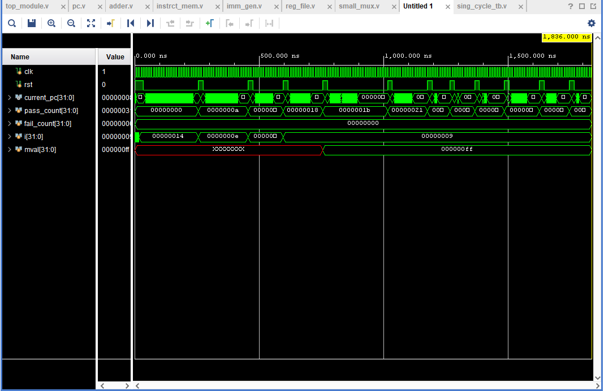
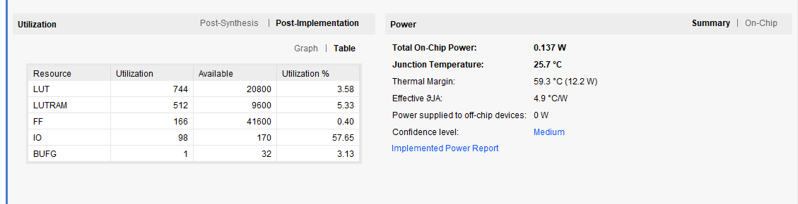

# RISC-V RV32I Single-Cycle Processor — SRAM-Based Physical Implementation

**Author:** Pranav Sapkale

## Index
1. [Overview](#overview)
2. [Supported Instruction Set Architecture (RV32I)](#supported-instruction-set-architecture-rv32i)
3. [Hardware Architecture & Datapath](#hardware-architecture--datapath)
   - [RTL Schematic](#rtl-schematic)
   - [Module Breakdown](#module-breakdown)
4. [Memory Subsystem — SRAM Macro Integration](#memory-subsystem--sram-macro-integration)
   - [Macro Port Configuration](#macro-port-configuration)
5. [Physical Design Flow (RTL → GDSII)](#physical-design-flow-rtl--gdsii)
   - [Toolchain & Environment](#toolchain--environment)
   - [Flow Stages](#flow-stages)
   - [Key Configuration Choices (config.json)](#key-configuration-choices-configjson)
6. [Results](#results-extracted-directly-from-the-physical-design-run)
7. [GDSII — Final Silicon Layout](#gdsii--final-silicon-layout)
   - [Die-Level View](#die-level-view)
   - [SRAM Macro Placement (Silicon Level)](#sram-macro-placement-silicon-level)
   - [GDS Export Notes](#gds-export-notes)
8. [Visualization](#visualization)
9. [Verification & Simulation](#verification--simulation)
10. [Synthesis Utilization](#synthesis-utilization)
11. [Future Roadmap](#future-roadmap)

## Overview
This repository contains the complete RTL-to-GDSII implementation of a 32-bit single-cycle RISC-V processor core, built on the base integer instruction set (RV32I) and carried all the way from Verilog RTL through an open-source physical design flow to a routed, DRC-clean silicon layout on the SkyWater Sky130 130nm process.

This is a significant evolution beyond a purely academic RTL exercise. In many university-level RISC-V projects, instruction and data memories are modeled behaviorally — a Verilog `reg` array inferred by the synthesis tool and mapped, more or less arbitrarily, onto standard-cell flip-flops. That approach is convenient for simulation but bears little resemblance to how memory is actually implemented in a real integrated circuit: a flip-flop cell in Sky130's `sky130_fd_sc_hd` library occupies roughly an order of magnitude more silicon area per bit than a 6T SRAM bitcell, and its per-access dynamic power is comparably worse, since every bit toggles on every clock edge rather than only on an active read or write. In this project, the processor's instruction and data memories are instead implemented as dedicated hard-macro SRAM blocks generated with **OpenRAM**, integrated directly into the floorplan and power delivery network like they would be in a real ASIC tapeout. The result is a design that reflects, in area, power, and routing behavior, what this core would actually look like in silicon — not just what it looks like in simulation.

The project's goal is twofold:

1. To serve as a **"Golden Reference Model"** — a functionally correct, physically implementable single-cycle baseline whose instruction semantics, memory interface, and timing behavior are fully characterized — ahead of a planned transition to a 5-stage pipelined architecture. Having a physically-implemented, timing-closed single-cycle core as a reference makes it possible to isolate, in the pipelined successor, which behavioral differences come from the pipelining transformation itself versus from the underlying ISA implementation.
2. To serve as a fully documented, reproducible case study in taking a processor core through an entirely open-source EDA toolchain, with no commercial license required at any stage — from RTL synthesis through GDSII stream-out, timing signoff, and IR-drop analysis.

## Supported Instruction Set Architecture (RV32I)
The processor supports a robust subset of the RISC-V RV32I unprivileged ISA, spanning all six base instruction formats:

| Format | Instructions | Opcode (bin) | Distinguishing fields |
|---|---|---|---|
| R-Type | `add`, `sub`, `sll`, `slt`, `sltu`, `xor`, `srl`, `sra`, `or`, `and` | `0110011` | `funct3` selects the operation class; `funct7[5]` distinguishes add/sub and srl/sra |
| I-Type (ALU) | `addi`, `slli`, `slti`, `sltiu`, `xori`, `srli`, `srai`, `ori`, `andi` | `0010011` | `funct3` selects the operation; `funct7[5]` (imm[10]) distinguishes srli/srai |
| I-Type (Load) | `lw`, `lh`, `lhu`, `lb`, `lbu` | `0000011` | `funct3` selects width and signed/unsigned extension |
| S-Type (Store) | `sw`, `sh`, `sb` | `0100011` | `funct3` selects width (byte/half/word) |
| B-Type (Branch) | `beq`, `bne`, `blt`, `bge`, `bltu`, `bgeu` | `1100011` | `funct3` selects the comparison predicate |
| J-Type (Jump) | `jal` | `1101111` | unconditional; 20-bit sign-extended, bit-scrambled immediate |
| I-Type (Jump) | `jalr` | `1100111` | indirect jump; target is rs1 + sign-extended 12-bit immediate, LSB cleared |
| U-Type | `lui`, `auipc` | `0110111` / `0010111` | 20-bit immediate loaded into bits [31:12]; `auipc` additionally adds the current PC |

Each instruction format uses a distinct immediate encoding. The `imm_gen` module (below) is responsible for correctly re-assembling these fields — a task that is deceptively fiddly in the RISC-V encoding, since the immediate bits are deliberately non-contiguous in the instruction word, a choice made to minimize the bit-multiplexing needed in hardware relative to a naive contiguous encoding.

## Hardware Architecture & Datapath
The top-level module (`top_module.v`) connects the individual functional blocks into a unified single-cycle datapath. Data and control signals propagate combinationally through the modules within a single clock period, updating architectural state (Registers, PC, and now SRAM-backed memory) on the rising clock edge. Because there is exactly one clock edge per instruction, the entire fetch-decode-execute-memory-writeback sequence must settle combinationally within one clock period — this is precisely why the `CLOCK_PERIOD` chosen for physical design (50 ns) is generous relative to what a pipelined implementation of the same logic would require.

### RTL Schematic
Below is the generated schematic of the single-cycle datapath, showing the interconnection of the program counter, instruction memory, register file, immediate generator, ALU, branch unit, and data memory, along with the multiplexers selecting between alternative data sources at each stage boundary:

### Module Breakdown
*   **`top_module.v`**: The structural wrapper that instantiates and wires all datapath components, control lines, and the two SRAM macros together. This module has no combinational logic of its own — it is purely structural, which keeps the synthesis tool's view of the design hierarchy clean and simplifies floorplanning since macro instances sit one level below `top`.
*   **`CU.v` (Control Unit)**: The main decoder that takes the 7-bit instruction opcode and generates all primary multiplexer selects, memory enable flags, and execution unit signals. It is implemented as a combinational `case`/`casez` block over the opcode alone; instruction-specific behavior within an opcode class (e.g., distinguishing `add` from `sub`) is deferred to the ALU Control unit so `CU.v` stays a small, timing-friendly decoder.
*   **`pc.v` (Program Counter)**: A synchronous 32-bit register holding the current execution address, updated once per clock edge with either PC+4 or a branch/jump target selected by `branch_unit.v`. There is no separate PC-write-enable, since every instruction completes in exactly one cycle.
*   **`instrct_mem.v`**: Interface logic to the instruction SRAM macro. Translates the PC into the macro's address bus, holds read-enable continuously asserted (Harvard-style fetch every cycle), and passes the 32-bit read-data through to instruction decode. Replaces the earlier 1024x32 behaviorally inferred instruction memory used in the flip-flop-only version of this project.
*   **`reg_file.v`**: A 32x32-bit integer register file supporting two concurrent asynchronous reads (rs1, rs2) and one synchronous write (rd) on the positive clock edge. Register `x0` is hardwired to zero: writes to x0 are architecturally discarded and reads always return zero, matching the RV32I spec exactly.
*   **`imm_gen.v`**: Extracts and sign-extends immediate values from the 32-bit instruction based on the opcode format (I, S, B, U, J). For B-type and J-type instructions in particular, the immediate bits are permuted rather than contiguous in the instruction word, so this module reassembles the scattered bits into the correct signed offset before sign-extension to 32 bits.
*   **`ALU.v`**: The Arithmetic Logic Unit executing additions, subtractions, bitwise logic, and shifts (logical and arithmetic). It outputs zero and less-than flags for branch evaluation: `alu_zero` is asserted on an all-zero result (used for beq/bne), while `alu_lt`/`alu_ltu` are asserted based on signed and unsigned comparison respectively (used for blt/bge and bltu/bgeu).
*   **`ALUCU.v` (ALU Control)**: A secondary control decoder that takes the main `alu_op` signal alongside the instruction's `funct3` and `funct7` (bit 30) fields to dictate the precise ALU operation — e.g., distinguishing between arithmetic and logical right shifts (srl vs sra), or add vs sub, both of which share opcode and funct3 but differ in funct7 bit 5.
*   **`branch_unit.v`**: Evaluates branch conditions (`funct3`) against ALU flags (`alu_zero`, `alu_lt`, `alu_ltu`) and jump signals to assert the `pc_src` flag, redirecting the Program Counter if a branch is taken. Because branch resolution and target computation both happen combinationally within the same cycle as the compare, there is no branch prediction or speculation in this single-cycle design — every outcome is known before the next PC latches, which is architecturally simple but is exactly the long combinational path that motivates the future move to pipelining.
*   **`data_mem.v`**: Interface logic to the data SRAM macro, handling precise byte (`sb`/`lb`), half-word (`sh`/`lh`), and word (`sw`/`lw`) alignments and sign-extensions. Sub-word stores use the SRAM macro's byte-enable lines to write only the targeted bytes without disturbing the rest of the word; sub-word loads read the full word and then extract/extend the relevant byte or half-word combinationally before writeback.
*   **`adder.v`**: Reusable 32-bit arithmetic adders used for incrementing `PC+4` and calculating branch target addresses. The module is instantiated twice rather than shared across both uses, trading a small amount of extra area for a simpler, purely combinational structural style with no muxing on the adder inputs.
*   **`wb_mux.v` & `small_mux.v`**: Datapath routing multiplexers for ALU operands, write-back data, and PC next-state selection. `wb_mux.v` selects among ALU result, memory read data, PC+4 (for jal/jalr link value), and the immediate (for lui); `small_mux.v` handles ALU second-operand selection between rs2 and the decoded immediate.
*   **`sky130_sram_1kbyte_1rw1r_32x256_8.v`**: The OpenRAM-generated hard-macro SRAM model used for both instruction and data memory (see below).

## Memory Subsystem — SRAM Macro Integration
The single largest architectural change from the original all-flip-flop implementation is the memory subsystem:

*   Instruction and data memory are each implemented as a **1 KB (1024 x 32-bit) SRAM macro**, generated with **OpenRAM**, rather than as synthesized register arrays.
*   Using two 1 KB macros instead of 1024 discrete registers keeps the instruction/data address space bounded to a 1024-word limit while producing a far more area- and power-efficient result than an equivalent flip-flop-based memory would.
*   Each macro is instantiated as a hard macro (`sky130_sram_1kbyte_1rw1r_32x256_8`) with its own `.gds`, `.lef`, and `.lib` views, so the physical design flow treats it as a fixed, pre-characterized block rather than something to synthesize.
*   Macros are placed at the edges of the floorplan (via an explicit `MACRO_PLACEMENT_CFG` coordinate file) to keep them out of the way of the dense central standard-cell routing for the 32-bit register file/ALU interconnect.
*   Each macro's power pins are explicitly stitched into the chip-level power delivery network (`PDN_MACRO_CONNECTIONS`) so both memories receive the same VDD/GND mesh as the surrounding standard cells.

### Macro Port Configuration
The naming convention `sky130_sram_1kbyte_1rw1r_32x256_8` encodes the macro's physical organization: 1 KB of total storage, one read/write port plus one read-only port (1RW1R), organized as 256 words of 32 bits with 8-bit byte-enable segments. This dual-port configuration is more capable than either interface strictly requires on its own — the instruction side only ever reads, and the data side both reads and writes — but reusing the same pre-characterized macro for both keeps the OpenRAM characterization, LEF/LIB views, and physical footprint identical for both instances, simplifying floorplanning and reducing the number of distinct hard-macro views the flow has to manage.

*   **Instruction memory** (`insmem.inst_ram_block`): the read/write port is tied to read-only operation from the datapath's perspective (write-enable held de-asserted), since this design does not support self-modifying code or runtime instruction loading beyond initial memory preload.
*   **Data memory** (`datamem.data_ram_block`): the read/write port services both `lw`-family and `sw`-family instructions, with byte-enable-qualified writes for `sb`/`sh` and full-word writes for `sw`.
*   **Address decoding**: the lower word-address bits ([11:2] of the byte address) select one of 1024 words in each macro; addresses outside this bounded range are not supported by the current memory map — a known constraint carried into the Future Roadmap.

## Physical Design Flow (RTL → GDSII)
This project doesn't stop at RTL — it carries the design through a complete, open-source physical implementation flow using **LibreLane/OpenLane**, **Yosys**, **OpenROAD**, and the **SkyWater Sky130** open PDK.

### Toolchain & Environment
*   Package/environment management handled entirely with **Nix**, which pins every tool (Yosys, OpenROAD, Magic, KLayout, Netgen, and their transitive dependencies) to reproducible, hash-addressed versions so the flow is bit-for-bit reproducible on another machine.
*   Deliberately run on **Ultramarine Linux** (Red Hat/Fedora-derived) instead of the officially recommended Ubuntu-based distribution, to test flow portability outside the vendor-blessed environment.
*   `RUN_MAGIC` was disabled to bypass a Magic GDS stream-out dependency failure specific to this environment; **KLayout** was used for GDSII stream-out instead, with no loss of routing/layout completeness.

### Flow Stages
1.  **Logic Synthesis** — Yosys/ABC technology-maps the RTL to Sky130 standard cells under an `AREA 0` optimization strategy. Yosys first elaborates and generic-optimizes the RTL (constant propagation, dead-code elimination), then hands the generic gate-level netlist to ABC, which performs technology mapping against the `sky130_fd_sc_hd` liberty timing views. Area-oriented mapping is chosen deliberately over a delay-oriented strategy given the generous 50 ns clock period target, leaving ample timing slack to spend on area reduction instead.
2.  **Floorplanning & PDN Generation** — fixed 1500x1500 µm die / 1480x1480 µm core, with the two SRAM macros placed at the floorplan edges and a VDD/GND metal mesh built across the upper metal layers. The PDN is a standard ring-plus-stripe topology: a peripheral ring on the upper metal layers connects to pad/macro power pins, with straps running across the core to keep IR drop low under the combined switching load of the standard-cell fabric and both SRAM macros.
3.  **Global & Detailed Placement** — RePlace performs wirelength-driven global placement at a 40% target density; OpenDP legalizes cell positions to the manufacturing grid. RePlace's analytic (electrostatics-based) placer treats cells as charged particles minimizing a wirelength potential field subject to a density constraint; the 40% target leaves substantial routing headroom given the wide 32-bit buses that dominate this design's interconnect.
4.  **Clock Tree Synthesis** — TritonCTS builds a balanced H-tree from `clk` to all sequential sinks using `sky130_fd_sc_hd` clock buffers, targeting minimal skew across the register file write port, PC register, and other clocked state elements so signoff timing margins aren't eroded by clock uncertainty introduced by the tree itself.
5.  **Global & Detailed Routing** — FastRoute plans congestion-aware routing guides across `met1`–`met5`; TritonRoute performs DRC-clean detailed wiring and via insertion, converting the abstract routing guides into manufacturable geometry satisfying Sky130's minimum width, spacing, and enclosure rules on every layer.
6.  **Signoff** — Static timing analysis across 9 PVT corners, plus IR-drop analysis on the VPWR/VGND power nets. The 9-corner sweep spans typical, fast, and slow process corners crossed with nominal and off-nominal supply/temperature conditions — the standard way to bound worst-case timing and power behavior across manufacturing and operating variation without full Monte Carlo simulation.
7.  **GDSII Stream-Out** — via KLayout, using the Sky130A `.lyp` layer property file for visualization, merging the routed OpenROAD database with each macro's pre-supplied GDS to produce the final full-chip layout.

### Key Configuration Choices (`config.json`)
| Parameter | Value | Why |
|---|---|---|
| `CLOCK_PERIOD` | 50.0 ns | Conservative period to accommodate the long single-cycle critical path without forcing synthesis to over-optimize for area. |
| `FP_CORE_UTIL` / `PL_TARGET_DENSITY_PCT` | 40% / 40% | Heavy 32-bit bus routing needs headroom; low density avoids detailed-routing DRC congestion. |
| `SYNTH_STRATEGY` | `AREA 0` | Prioritizes area; can be swapped to a delay-oriented strategy if setup timing fails. |
| `DIE_AREA` / `CORE_AREA` | 1500x1500 / 1480x1480 µm (absolute) | Fixed sizing chosen to fit both SRAM macros plus logic with margin. |
| `MACRO_PLACEMENT_CFG` | `macro.cfg` | Explicit edge placement for the two SRAM macros to protect central routing. |
| `RUN_MAGIC` | `false` | Bypasses a Nix/Ultramarine-specific Magic stream-out failure; KLayout used instead. |

Two additional flags carried through from the macro-integration work govern how downstream DRC/LVS tooling treats the SRAM macros: `MAGIC_DRC_USE_GDS` and `MAGIC_EXT_USE_GDS` were left enabled so that, if Magic-based DRC/LVS is run later, it checks against this same GDS geometry rather than re-deriving macro geometry from the LEF abstract — LEF views are intentionally simplified for placement/routing and are not a substitute for full-geometry DRC.

## Results (extracted directly from the physical design run)
*   **Cell inventory (post-CTS):** 33,257 total cells / 503,770 µm², including 2 SRAM macros (381,425 µm²), 1,055 sequential cells, 3,979 multi-input combinational cells, and 210 clock buffers. The two SRAM macros alone account for roughly 76% of total placed-cell area — a concrete illustration of why the hard-macro approach was worth the added floorplanning and PDN-stitching complexity versus letting the memories synthesize as flip-flops.
*   **Clock tree:** 143 clock buffers across 143 subnets reaching 1,057 sequential sinks; max clock-tree depth of 4 levels. A shallow 4-level tree at this sink count is consistent with the generous clock period leaving CTS free to prioritize a simple, low-skew topology over an aggressively buffered one.
*   **Timing:** hold timing met with positive slack across all 9 PVT corners tested; setup timing met at nominal and fast-process corners, with violations only at the worst-case slow-process corner (`-1.2449 ns` WNS / `-4.8272 ns` TNS across 9 paths) — an expected consequence of the single-cycle critical path, which routes through instruction fetch, register read, ALU, data memory access, and register writeback all within one cycle. This is precisely the bottleneck pipelining is intended to resolve.
*   **Routing:** average congestion of 6.49% across all metal layers with **zero overflow** anywhere; ~739,000 µm total wirelength across 8,145 nets and 69,099 vias. The zero-overflow result at 40% placement density confirms the density/macro-placement choices were conservative enough to avoid detailed-routing DRC violations, at the cost of a larger-than-minimum die area.
*   **Power / IR drop:** 1.96 mW total core power at nominal conditions; worst-case IR drop of just 0.02% of supply voltage on both VPWR and VGND — well inside typical signoff margins (industry rule-of-thumb thresholds are typically 5–10%), indicating the ring-plus-stripe PDN comfortably services both the standard-cell fabric and the two SRAM macros without localized voltage droop.

## GDSII — Final Silicon Layout
The flow terminates in a full GDSII stream-out of the routed design — the actual polygon-level geometry that would be handed to a foundry for fabrication. This is the artifact that separates this project from a purely RTL/FPGA exercise: every cell, macro, and wire below has real, DRC-checked physical geometry on the Sky130 process.

### Die-Level View

*   **File:** `top_module.gds`, viewed in **KLayout 0.30.7**.
*   **Die area:** 1500 x 1500 µm (absolute), **core area:** 1480 x 1480 µm, per the `DIE_AREA`/`CORE_AREA` settings in `config.json`.
*   The dense, uniformly hatched region filling the core is the standard-cell placement — tap cells, fill cells, combinational logic, sequential cells, and clock buffers — rendered here on the boundary/outline layer (`235/4` in the Sky130 GDS layer map, shown selected in the Layers panel).
*   Faint vertical/horizontal striping visible through the core is the upper-metal (met4/met5) power distribution mesh, running across the die to feed both standard cells and the two SRAM macros.
*   The **Cells** panel (left) lists every standard-cell master used in the design, pulled in from the Sky130 `sky130_fd_sc_hd` library — logic gates (`a211oi`, `a21oi`, `a2bb2o`, `and2`, `and3`, `and4`...), buffers/inverters (`buf_1`, `buf_4`, `inv_2`...), clock cells (`clkbuf_2/4/16`, `clkdlybuf4s25_1`), fill/decap/tap cells, and DFF/latch cells (`dfxtp_2`, `dlygate4sd3_1`) — confirming the design is composed entirely of pre-characterized, foundry-qualified cells rather than abstract logic.
*   No DRC violation markers are present in this view; the geometry shown is what streamed out cleanly after detailed routing.

### SRAM Macro Placement (Silicon Level)

*   Close-up of the die's lower edge showing the two integrated SRAM hard macros: **`insmem.inst_ram_block`** (instruction memory, right) and **`datamem.data_ram_block`** (data memory, left), each a `sky130_sram_1kbyte_1rw1r_32x256_8` macro dropped in directly from its OpenRAM-generated `.gds`.
*   The pink/pill-colored regions are the macro boundary outlines pulled from each macro's `.lef` abstract; the dense red/magenta vertical routing between the two macros is the shared address/control/power interconnect stitched across both blocks.
*   Green and yellow traces below and around the macros are the standard-cell-layer routing (met1–met3) connecting the memories to the rest of the datapath — visibly denser directly beneath the macros, where the 32-bit address and data buses fan out.
*   This placement — both macros pinned along one edge of the die rather than scattered through the core — is a direct result of the `MACRO_PLACEMENT_CFG` coordinates and is what kept central-core routing congestion low (see Results: 6.49% average congestion, zero overflow).
*   Both macros' `vccd1`/`vssd1` power pins are visible tying directly into the surrounding power mesh, per the `PDN_MACRO_CONNECTIONS` configuration.

### GDS Export Notes
*   GDSII stream-out was performed via **KLayout**, not Magic — `RUN_MAGIC` was set to `false` to route around an environment-specific Magic dependency failure (see *Physical Design Flow* above). KLayout merged the routed OpenROAD database with each macro's pre-supplied `.gds` (`sky130_sram_1kbyte_1rw1r_32x256_8.gds`) to produce the final full-chip stream-out.
*   `MAGIC_DRC_USE_GDS` and `MAGIC_EXT_USE_GDS` were left enabled in `config.json` so that, if Magic-based DRC/LVS is run later, it will check against this same GDS geometry rather than re-deriving it from LEF.
*   `MAGIC_WRITE_FULL_LEF` was disabled since no further hierarchical abstraction of `top_module` was needed for this run.
*   Final GDS output includes all fill, tap, and decap cells inserted during placement/CTS, so the streamed-out die is fill-complete and ready for the DRC/LVS signoff step noted in the Future Roadmap.

## Visualization
*   **KLayout** — used with the Sky130A `.lyp` property file, with base substrate layers (N-well, P-well, diffusion) disabled to isolate standard-cell and SRAM macro placement for clean figures.
*   **OpenROAD GUI** — used to load the routed `.odb` database and strip away power-grid and manufacturing-grid layers for high-contrast routing-density visualizations.
*   **Blender + GDS3D** — used for 3D silicon-level renders of the final layout, extruding each GDS layer to its process-defined thickness to produce an approximate physical cross-section view useful for presentation and intuition-building, though not a substitute for formal process cross-section data.

## Verification & Simulation
The processor's functionality has been verified using a self-checking testbench to ensure proper instruction decoding, arithmetic execution, and memory read/writes against the SRAM-backed instruction and data memories. Because the instruction and data memories are now modeled with the OpenRAM-generated behavioral/gate-level SRAM model rather than a simple Verilog `reg` array, verification also exercises the SRAM macro's port timing model (read/write enable setup, address setup) to confirm the datapath's control signals meet the macro's own interface timing requirements — not just architectural correctness.

Below are the simulation waveforms demonstrating correct execution:

## Synthesis Utilization
The design has been synthesized to analyze logic block, register, and SRAM macro resource consumption. The utilization report below breaks down cell-count and area contributions by category (combinational logic, sequential elements, clock buffers, and the two SRAM macros), corroborating the Results finding that the SRAM macros dominate total die area relative to the comparatively compact standard-cell logic implementing the datapath and control.

Below is the utilization report for the SRAM-based implementation:

## Future Roadmap
This single-cycle, SRAM-backed implementation is phase two of a larger VLSI development cycle (phase one being the original flip-flop-only version). Upcoming milestones include:
1.  **Pipelining:** Transformation into a 5-stage (IF, ID, EX, MEM, WB) pipelined architecture to close the setup-timing gap observed at worst-case slow-process corners and substantially raise maximum operating frequency. Splitting the current single-cycle critical path — fetch through writeback — across five pipeline registers should shrink the per-stage combinational delay roughly in proportion to the number of stages, the primary lever for recovering the slow-corner setup violation and enabling a materially shorter `CLOCK_PERIOD` than the current 50 ns.
2.  **Hazard Mitigation:** Implementation of forwarding logic and load-use hazard detection units for the pipelined core, since introducing pipeline stages reintroduces data hazards (RAW dependencies between adjacent instructions) and control hazards (branch/jump resolution latency) that the single-cycle design does not have to contend with by construction.
3.  **Low-Power Exploration:** Investigating reduced-voltage and clock-gated variants of the same OpenLane/Sky130 flow, building on the already low measured IR drop to explore how much further core power can be reduced before timing or noise margins become limiting.
4.  **Full Signoff:** Extending the current placement/CTS/routing results with parasitic-extracted (RCX) final timing signoff and a complete DRC/LVS clean report, the remaining gap between the current routed-and-DRC-clean layout and a layout that would actually be ready to hand to a foundry for fabrication.
